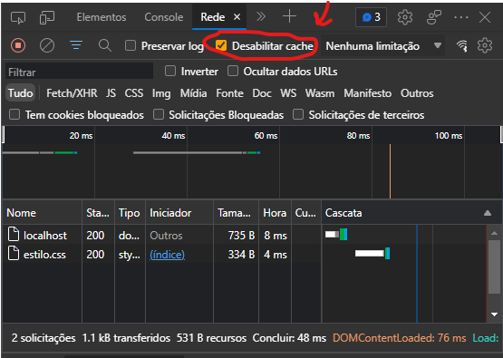

## Navegadores e seu Cache

Para navegadores reduzirem a quantidade de arquivos pedidos ao servidor, eles guardam arquivos estáticos (.html, .css, imagens, ...), entretanto eles não pegam a nova versão a não ser que sejam explicitamente pedidos. No devtools tem a opção de desabilitar o cache

